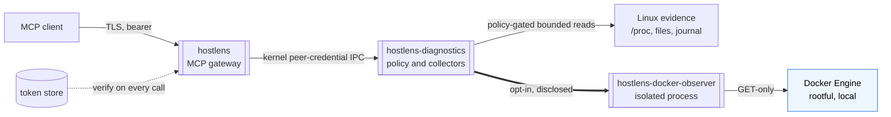

# HostLens

[](https://github.com/Monska85/hostlens/actions/workflows/ci.yml)
[](https://github.com/Monska85/hostlens/actions/workflows/release.yml)
[](LICENSE)
[](docs/v1/SPEC.md)
[](openspec/specs)

HostLens gives agents controlled access to host diagnostics through the Model Context Protocol (MCP). It returns observed system information and explicit collection failures, never silent gaps. Bearer authentication, fixed roles, administrator-defined source policies, and finite collection ceilings apply to every request.

There is no remediation, no shell execution, no background monitoring, and no call to any model provider. The gateway and the diagnostic backend run as separate processes with kernel-verified identities; neither component calls out to the network.

**Scope:** Linux amd64 and arm64 with systemd installation. macOS, Windows, and separately authorized remediation are future work.

## 🚀 Quick start

Root on a Linux target host with systemd and kernel 5.6 or newer (the first tool call needs `openat2`):

```sh
# 1. Download the newest release archive and checksums (repository readers
#    can use gh; a browser works too):
gh release download v0.4.0 -R Monska85/hostlens \
  -p 'hostlens-0.4.0-linux-*.tar.gz' -p checksums.txt

# 2. Verify, extract, install, and start:
sha256sum --ignore-missing -c checksums.txt
mkdir -p /opt/hostlens-release
tar -xzf hostlens-0.4.0-linux-amd64.tar.gz -C /opt/hostlens-release
/opt/hostlens-release/hostlens install --source /opt/hostlens-release --privilege standard --apply --start

# 3. Issue a token; the secret prints once:
/usr/local/bin/hostlens token create --system \
  --name first-client --roles diagnostics \
  --expires "$(date -u -d '+30 days' +%Y-%m-%dT%H:%M:%SZ)"

# 4. Confirm the full stack with one call:
curl -sS -X POST http://127.0.0.1:8080/mcp \
  -H "Authorization: Bearer $SECRET" \
  -H "Content-Type: application/json" \
  -H "Accept: application/json, text/event-stream" \
  -H "MCP-Protocol-Version: 2025-06-18" \
  -d '{"jsonrpc":"2.0","id":1,"method":"tools/call","params":{"name":"get_os_info","arguments":{}}}'
```

The installer writes a minimal `/etc/hostlens/config.yaml`; the defaults are already safe:

```yaml
version: 1
mode: system
privilege: standard

mcp:
  read_only: true

metrics:
  enabled: true
  allow_anonymous: false

# Docker diagnostics are opt-in and disabled by default.
```

The full path, including restricted privilege, Docker diagnostics, profiles, and upgrades, lives in the [installation guide](docs/v1/INSTALL.md).

## 🔍 What it does

| Capability         | What you get                                                                                                                    |
| ------------------ | ------------------------------------------------------------------------------------------------------------------------------- |
| 🔍 Inspect         | OS identity, hardware inventory, resource health, services, and installed packages                                              |
| 📡 Audit           | Explicitly authorized process, network, account, storage, security, metadata, and deployment evidence through generic tools     |
| 🐳 Observe Docker  | Opt-in, read-only evidence from the local system-wide Docker Engine through an isolated observer with a typed GET-only contract |
| 📖 Read sources    | Bounded UTF-8 configuration files, JSONL logs, raw tails, and selected journal units, each behind an explicit policy grant      |
| 🔒 Control access  | Expiring tokens, role checks on every call, profile includes, and global denial precedence                                      |
| 🧰 Operate locally | Explicit installation, policy reload, token administration, recoverable upgrades, and tracked removal                           |

## 🚫 What it will not do

| Refusal                    | Mechanism                                                                                                        |
| -------------------------- | ---------------------------------------------------------------------------------------------------------------- |
| Execute shell commands     | No command, exec, or generic request tool exists in the registry                                                 |
| Remediate anything         | Read-only effect registry enforced at HTTP, session, per-call, and backend layers; remediation is rejected in v1 |
| Monitor in the background  | Work happens only on request, under bounded admission with no periodic host polling                              |
| Call model providers       | The gateway and backend terminate MCP and read the host; they never call out                                     |
| Return secrets or payloads | Source policy, secret masks, and payload-free audit records keep credentials and inspected content out of sight  |

## 🏗 Architecture



Reading the diagram: solid edges are the primary request path, the dotted edge is the credential check the gateway performs on every call, and the thick edge is the opt-in Docker integration that only exists after an administrator runs `hostlens reconcile --system --apply`. The blue box is the one external system. Every IPC hop verifies the peer's kernel identity; the observer rejects any peer that is not the diagnostic backend, including root.

## 🔒 Security model

Choose diagnostic privilege deliberately:

- **Restricted:** ordinary OS permissions; inaccessible sources are reported honestly.
- **Standard:** only the backend receives `CAP_DAC_READ_SEARCH` for broad host reads; secret masks and service hardening are generated for you.

Profiles constrain supported diagnostic requests, not a compromised privileged process. Allowed application files may contain secrets. Protect every network hop that carries bearer credentials, and treat returned log and configuration content as untrusted data. Full hardening tables and caveats: [Operating HostLens](docs/v1/OPERATIONS.md).

## ✅ Validation

- Go race suite, vet, and amd64/arm64 builds in disposable containers; 85.9% internal statement coverage.
- A 12-case container acceptance matrix that extracts and executes the exact release candidate, including native arm64 systemd install/upgrade/removal on hosted runners.
- Strict OpenSpec validation; the [specifications](openspec/specs) are authoritative.
- Checksum-verified archives with a shipped-documentation link check; build provenance attestations activate when GitHub offers them for the repository.
- Fresh `govulncheck` scan with no reachable vulnerabilities at scan time.

Evidence and remaining limits: [validation evidence](docs/v1/VALIDATION.md).

## 📚 Documentation

| Document                                     | Read it when                                      |
| -------------------------------------------- | ------------------------------------------------- |
| [Installation guide](docs/v1/INSTALL.md)     | You are installing or upgrading a host            |
| [Operating HostLens](docs/v1/OPERATIONS.md)  | Day-two reference: tools, policy, limits, logs    |
| [Validation evidence](docs/v1/VALIDATION.md) | You need tested behavior and known limits         |
| [Product specification](docs/v1/SPEC.md)     | You want the architecture and platform boundaries |
| [Release engineering](docs/RELEASING.md)     | You build, validate, or cut releases              |

## 🔧 Develop and validate

Prepare the [base toolchain](docs/RELEASING.md#toolchain); setup installs the repository's locked development tools locally.

```sh
make deps
make test-image
make check
make build
make package
make verify-archives
```

`make build` compiles to `bin/` using Go only. `make package` creates installable archives in `dist/archives/`; acceptance verifies and executes those archive bytes, so package again after changing source. See [local validation and matrix prerequisites](docs/RELEASING.md#local-validation) for cache overrides, systemd cases, and arm64 support; every executable test runs in disposable containers. `make coverage` writes an HTML report; `make help` and `just --list` list equivalent commands.

[Current OpenSpec specifications](openspec/specs) are authoritative and [archived changes](openspec/changes/archive) preserve design rationale; discover unfinished work with `openspec list`. Changes must preserve the separate authentication, source policy, and OS privilege boundaries; new platform support implements native collectors, safe filesystem handling, credentials, IPC, and lifecycle adapters without changing Linux rule meanings.

## 📄 License

[Apache-2.0](LICENSE), copyright 2026 Monska85 and HostLens contributors. [NOTICE](NOTICE) records attribution. Executable archives include project and dependency license notices.
